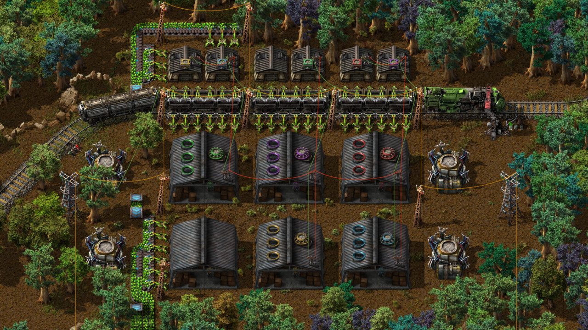

# Warehousing

Mod for Factorio. *Store **all** the things!* (We heard you like boxes, you packrat you!)

## News

Go grab it now, or get it in game by searching for Warehousing.

### Translations!
Want to see Warehousing available in your language? Does the quality of our existing translation leave you wanting more? Please help us [translate the mod](https://crowdin.com/project/factorio-warehousing) on Crowdin! Create a free account (or log in with Google, Twitter, Facebook, GitHub, or Gitlab) and help make this mod (even more) awesome!

### Latest

Now compatible with Factorio 0.16! Research requirements have changed (again), so be warned for new games.

Logistic warehouse research cost is now based on the cost of "Logistic System", for balance when using mods that alter that research. Some mods may alter it too late for Warehousing to use the new values; report these incompatible mods in [the forum thread](https://forums.factorio.com/viewtopic.php?f=93&t=17295) or [GitHub issue tracker](https://github.com/Warehousing/Warehousing/issues) and they should be fixable.

### Previously

Warehouses were changed to 6x6 as per a suggestion, so if you are upgrading from a very old version of the mod it will make all existing warehouses potentially overlap and cause unknown issues. You have been warned! (If you've transitioned a steam power setup from Factorio 0.14 or below to 0.15, you know the pain.)

Factorio 0.12.18 allowed entity inventories to have scroll bars... Capacities were increased to take advantage of this. Please note that using significant numbers of warehouses _will_ cause a significant performance decrease. (Entity update performance is directly related to inventory slot count, so more slots to process on each tick means it will take longer.)

## Description

Adds 6x6 warehouses that allow you to store a lot of items, and smaller (cheaper) 3x3 storehouses with less capacity.

Warehouses and storehouses also have logistic versions (passive provider, active provider, and storage), just like chests.

You can also attach red and green wires to the warehouses, and they'll attach to the correct points on the corner of the logistics warehouses.

---
No.|Warehouse|Storehouse
-|-|-
1.|Basic warehouse: 1800 slots|Storehouse: 450 slots
&nbsp;|![Basic Warehouse][warehouse-basic]|![Basic Storehouse][storehouse-basic]
2.|Storage warehouse: 2000 slots|Storehouse: 500 slots
&nbsp;|![Storage Warehouse][warehouse-storage]|![Storage Storehouse][storehouse-storage]
3.|Passive provider warehouse: 1800 slots|Storehouse: 450 slots
&nbsp;|![Passive provider warehouse][warehouse-passive-provider]|![Passive provider storehouse][storehouse-passive-provider]
4.|Active provider warehouse: 1800 slots|Storehouse: 450 slots
&nbsp;|![Active provider warehouse][warehouse-active-provider]|![Active provider storehouse][storehouse-active-provider]
5.|Requester warehouse: 1800 slots|Storehouse: 450 slots
&nbsp;|![Requester warehouse][warehouse-requester]|![Requester warehouse][storehouse-requester]
6.|Buffer warehouse: 1800 slots|Storehouse: 450 slots
&nbsp;|![Buffer warehouse][warehouse-buffer]|![Buffer warehouse][storehouse-buffer]

### Recipes

#### Basic warehouse / storehouse

Item|Qty
---|---:
Steel plate | 200
Iron stick | 85
Stone brick | 40
![Basic Warehouse][warehouse-basic]

Item|Qty
---|---:
Steel plate | 50
Iron stick | 16
Stone brick | 10
![Basic Storehouse][storehouse-basic]

#### Storage warehouse / storehouse

Item|Qty
---|---:
Basic warehouse|1
Storage logistic chest|1
Steel plate|10
Iron stick|15
![Storage Warehouse][warehouse-storage]

Item|Qty
---|---:
Basic storehouse|1
Storage logistic chest|1
Iron stick|4
![Storage Storehouse][storehouse-storage]

#### Passive provider warehouse / storehouse

Item|Qty
---|---:
Basic warehouse|1
Passive provider logistic chest|1
Steel plate|10
Iron stick|15
![Passive provider warehouse][warehouse-passive-provider]

Item|Qty
---|---:
Basic storehouse|1
Passive provider logistic chest|1
Iron stick|4
![Passive provider storehouse][storehouse-passive-provider]

#### Active provider warehouse / storehouse

Item|Qty
---|---:
Basic warehouse|1
Active provider logistic chest|1
Steel plate|10
Iron stick|15
![Active provider warehouse][warehouse-active-provider]

Item|Qty
---|---:
Basic storehouse|1
Active provider logistic chest|1
Iron stick|4
![Active provider storehouse][storehouse-active-provider]

#### Requester warehouse / storehouse

Item|Qty
---|---:
Basic warehouse|1
Requester logistic chest|1
Steel plate|10
Iron stick|15
![Requester warehouse][warehouse-requester]

Item|Qty
---|---:
Basic storehouse|1
Requester logistic chest|1
Iron stick|4
![Requester storehouse][storehouse-requester]

#### Buffer warehouse / storehouse

Item|Qty
---|---:
Basic warehouse|1
Buffer logistic chest|1
Steel plate|10
Iron stick|15
![Buffer warehouse][warehouse-buffer]

Item|Qty
---|---:
Basic storehouse|1
Buffer logistic chest|1
Iron stick|4
![Buffer storehouse][storehouse-buffer]

## Contributors

Graphics by **Nova Kast**, **please do not use without permission!** (If you ask, you can probably use the images. Also, if you need custom graphics we can cook these up too if needed! ;) PM Anoyomouse on the Factorio forums for permission/requests.)

Storehouses contributed by Hanniballo. Updates for Factorio 0.15 contributed by kingarthur, with integration help from dgw (joined as co-maintainer as of 0.0.13).

Translations kindly provided by the following people:

| <!--flag--> | Language |          Translator          |
|-------------|----------|------------------------------|
| :fr:        | French   | Hasturcraft                  |
| :ru:        | Russian  | apriori Oceanel           |
| :poland:    | Polish   | diilmac                      |
| :de:        | German   | apcnc                        |
| :es:        | Spanish  | frenchiveruti                |
| :brazil:    | Brazil   | @RaphaelNeumann @scarsick |
| :jp:        | Japanese | Quifon                       |

[warehouse-basic]:https://raw.githubusercontent.com/Warehousing/Warehousing/master/graphics/entity/warehouse-basic.png
[warehouse-storage]:https://raw.githubusercontent.com/Warehousing/Warehousing/master/graphics/entity/warehouse-storage.png
[warehouse-passive-provider]:https://raw.githubusercontent.com/Warehousing/Warehousing/master/graphics/entity/warehouse-passive-provider.png
[warehouse-active-provider]:https://raw.githubusercontent.com/Warehousing/Warehousing/master/graphics/entity/warehouse-active-provider.png
[warehouse-requester]:https://raw.githubusercontent.com/Warehousing/Warehousing/master/graphics/entity/warehouse-requester.png
[warehouse-buffer]:https://raw.githubusercontent.com/Warehousing/Warehousing/master/graphics/entity/warehouse-buffer.png

[storehouse-basic]:https://raw.githubusercontent.com/Warehousing/Warehousing/master/graphics/entity/storehouse-basic.png
[storehouse-storage]:https://raw.githubusercontent.com/Warehousing/Warehousing/master/graphics/entity/storehouse-storage.png
[storehouse-passive-provider]:https://raw.githubusercontent.com/Warehousing/Warehousing/master/graphics/entity/storehouse-passive-provider.png
[storehouse-active-provider]:https://raw.githubusercontent.com/Warehousing/Warehousing/master/graphics/entity/storehouse-active-provider.png
[storehouse-requester]:https://raw.githubusercontent.com/Warehousing/Warehousing/master/graphics/entity/storehouse-requester.png
[storehouse-buffer]:https://raw.githubusercontent.com/Warehousing/Warehousing/master/graphics/entity/storehouse-buffer.png
